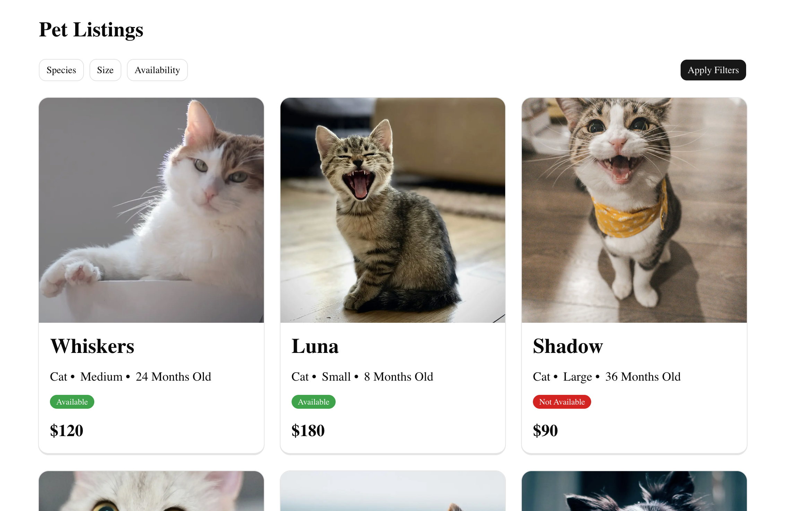

# Pet Marketplace

A basic marketplace application for listing and discovering pets, scaffolded from **Next.js**.



## Getting Started

### Prerequisites

- **Node.js** (LTS recommended)
- **npm** (comes with Node) or another package manager

### Installation

```bash
npm install
```

### Development

Run the development server:

```bash
npm run dev
```

Then open `http://localhost:3000` in your browser.

### Production Build

```bash
npm run build
npm start
```

## Project Structure

- `app/`
  - `layout.tsx` – Root layout (fonts, global wrappers)
  - `page.tsx` – Home page (landing)
  - `globals.css` – Global styles and Tailwind setup
  - `loading.tsx` / `error.tsx` / `global-error.tsx` / `not-found.tsx` – App-wide boundary components
  - `api/`
    - `inquiries/route.ts` – API route for submitting inquiries
  - `listing/`
    - `page.tsx` – Listing page (pets list + filters)
    - `components/`
      - `pet-card.tsx`, `pet-grid.tsx`, `pets-list.tsx` – Listing UI components
      - `filters/` – Filter UI (mobile/desktop, checkbox/radio controls)
    - `lib/`
      - `filters.ts` – Parsing and validation of listing URL filters
      - `use-pet-filters.ts` – Hook for managing filter state and URL syncing
  - `detail/[id]/`
    - `page.tsx` – Pet detail page entry
    - `components/`
      - `pet-detail.tsx`, `pet-detail-image.tsx`, `pet-detail-info.tsx`, `pet-detail-skeleton.tsx`
      - `inquiry-form.tsx`, `inquiry-form-dialog.tsx`, `inquiry-success-dialog.tsx`, `inquiry-error-dialog.tsx`
    - `lib/`
      - `use-inquiry-form.ts` – Hook for inquiry form state and submission
      - `utils.tsx` – Detail/inquiry-specific utilities

- `components/`
  - `common/`
    - `back-button.tsx` – Reusable “Back to Listings” button
    - `pet-image.tsx` – Resilient image component with skeleton + error fallback
  - `ui/`
    - Shadcn/Tailwind-based primitives: `button.tsx`, `card.tsx`, `badge.tsx`, `dialog.tsx`, `checkbox.tsx`,
      `radio-group.tsx`, `field.tsx`, `input.tsx`, `textarea.tsx`, `popover.tsx`, `label.tsx`, `separator.tsx`,
      `skeleton.tsx`, `spinner.tsx`

- `lib/`
  - `api/`
    - `fetch-pets.tsx` – Client for fetching pets from the backend
    - `submit-inquiry.tsx` – Client for posting inquiries
  - `utils.ts` – Generic utilities (e.g. `cn`)

- `types/`
  - `listing-types.tsx` – Shared domain types and enums (Pet, filters, etc.)

- `public/`
  - `readme_web_example.png` – Screenshot used in this README

- `next.config.ts` – Next.js configuration
- `tsconfig.json` – TypeScript configuration
- `eslint.config.mjs` / `postcss.config.mjs` – Linting and PostCSS configuration
- `package.json` / `package-lock.json` – Dependencies and scripts

## Available Scripts

- `npm run dev` – Start the development server
- `npm run build` – Create an optimized production build
- `npm start` – Start the production server
- `npm run lint` – Run ESLint

## Tech Stack

- **Framework**: Next.js
- **Language**: TypeScript
- **UI**: React
- **UI Library**: Shadcn + Tailwind
- **Data Fetching**: fetch

## Roadmap

### Pet Listing Page

- [x] Fetch Pets
- [x] Render each pet as a card/row
- [x] Unavailable pets should be visually distinguishable

### Filters (Support species, size and availability query parameters)

- [x] Filters update display results
- [x] UI handle loading and error states

### Pet Detail View

- [x] When user select a pet from listing page, show a detail view (Image, Details, Inquire CTA)
- [x] If pet unavailable, inquiry action should be disabled

### Inquiry Form

- [x] Submit Inquiry Form
- [x] Form Validation
- [x] Handle Form submission Success with inquiryId, receivedAt, Pet name and image - popup dialog
- [x] Handle Form submission Error - throw browser error
- [x] Prevent Duplicate Submissions when request is in flight - Button is in loading state

### Other Additional Features

1. Filter parameters are stored in local storage so filter state persists across refreshes and multiple tabs
2. Responsive layout (With the use of CSS Grid) + Filter options change accordingly
3. Pet detail page have their own routes - This means that users can share these links with others
4. 404 page is configured to handle misconfigured urls within the same domain
5. Global error page configured to handle any unexpected critical runtime errors beyond error page.

## Assumptions Made

1. Options for the filters are called and received separately from another endpoint. (Currently the types in listing-types are assumed to be all the size, species and availability options)
2. Small and Fixed number of pet listings
3. API request and response types are fixed as per indicated in the requirements and they are will always be there

## Key Tradeoffs/Possible Further improvements

1. Use of state management library such as Zustand or RTK if as there are more features added
2. Standardised Logging instead of just using console logs (Use Sentry or Pino)
3. Currently the pet listings can be rendered in one go due to the small number of listings - if listings were to exponentially increase, should implment either of below
   1. Load more button
   2. Infinite scrolling + Lazy Loading
   3. Pagination
4. SEO/SEM optimisation if this is meant to be an external facing website to improve web visibility
5. Design and Animation - For better user experience
6. Internationalisation - Support multiple languages if website is meant to be global
7. Testing - Should have component testing (Jest) and integrated testing (playwright) to ensure components work and show as expected
8. Type alignment with backend through a common data contract (Using Zod schema) to prevent regressions if there's any change
